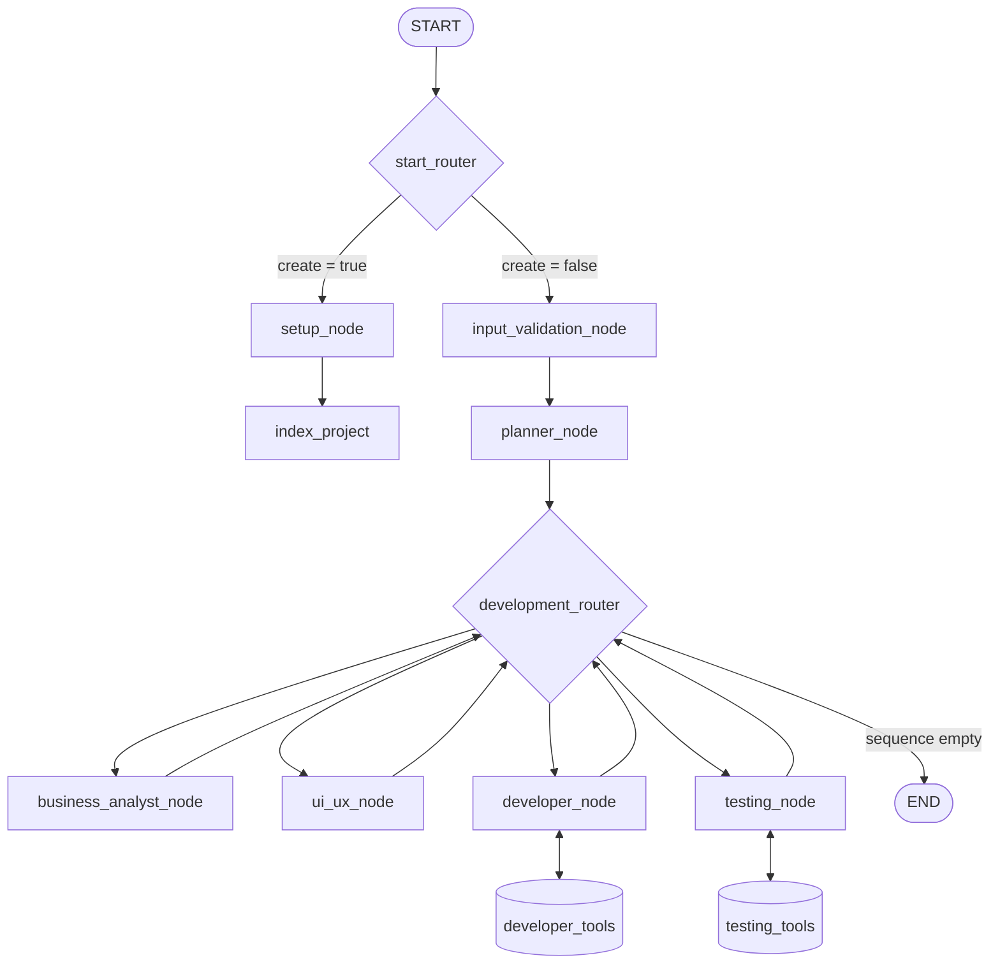

# deus_langgraph

> A production-grade multi-agent system built on LangGraph that orchestrates specialized AI agents — business analyst, UI/UX, developer, and testing engineer — to autonomously plan, implement, and verify changes to a Next.js codebase.

[](https://www.python.org/)
[](https://www.langchain.com/langgraph)
[](http://mypy-lang.org/)
[](https://docs.astral.sh/ruff/)
[](#license)

---

## Overview

`deus_langgraph` treats software development as a graph problem. A planner agent reads the current project state, decides which specialist agents need to run and in what order, and the graph executes that sequence — each agent reading and writing shared state, calling tools, and handing off to the next.

It's not a wrapper around a single LLM call. It's a stateful, tool-using, multi-agent orchestration layer with its own task-routing logic, execution budgets, and persistent project indexing — designed to operate on a real codebase the way a small engineering team would: someone scopes the work, someone designs it, someone builds it, someone tests it.

## Engineering Highlights

- **Dynamic agent orchestration** — a `planner_node` uses Claude to generate an ordered `sequence` of agents at runtime based on the task at hand, rather than relying on a hardcoded pipeline. A `development_router` pops agents off that sequence and routes the graph accordingly.
- **Tool-call budgeting** — `developer_node` and `testing_node` each enforce a hard cap (`MAX_TOOL_CALLS = 25`) to prevent runaway agent loops, a real constraint that matters once agents have shell access.
- **Codebase-aware agents** — a custom **tree-sitter** indexer parses `.js`, `.ts`, `.tsx`, and `.css` files into a byte-precise symbol map (functions, classes, byte ranges), giving agents structural awareness of the project instead of naive full-file reads.
- **Database-capable developer agent** — the developer node has its own Postgres toolset (`check_schema`, `create_schema`, `create_table`, `insert_rows`, `query_db`) alongside a general-purpose shell tool.
- **Production deployment pipeline** — containerized with Docker, built and pushed via `langgraph build` in GitLab CI/CD, and deployed over SSH-over-Tailscale to a remote macOS host running Colima as the Docker runtime — including handling Docker-in-Docker socket access, Tailscale auth race conditions, and `pmset` configuration for reliable always-on remote access.
- **Structured logging per thread** — a `ThreadedDateFileHandler` writes per-conversation logs to a date-partitioned directory tree (`LOGS_DIR/YYYY/MM/DD/HH/<thread_id>.log`), making individual agent runs fully traceable.
- **Strict code hygiene** — `mypy --strict`, `ruff` (lint + format), Google-style docstrings, and `codespell` are enforced via `make lint`.

## Architecture



`start_router` checks a `create` flag to decide whether this is a brand-new project (→ `setup_node` → `index_project`) or an existing one (→ `input_validation_node` → `planner_node`). The planner produces an ordered list of agents to run; `development_router` works through that list one agent at a time until it's empty, then ends the run.

### State

```python
class AgentState(TypedDict):
    create: bool                    # New project flag
    messages: list[AnyMessage]      # Accumulated message history
    summary: str                    # Conversation summary
    project_structure: dict         # Tree-sitter parsed code index
    tool_call_count: int            # Developer agent tool budget counter
    testing_tool_call_count: int    # Testing agent tool budget counter
    sequence: list[NodePrompts]     # Planned agent execution order
```

## Tech Stack

| Layer | Technology |
|---|---|
| Agent orchestration | LangGraph |
| LLM | Anthropic Claude (Messages API) |
| Language | Python 3.10+ |
| Code parsing / indexing | Tree-sitter |
| Database | PostgreSQL |
| Observability | LangSmith |
| Containerization | Docker / Docker Compose, Colima (remote runtime) |
| CI/CD | GitLab CI |
| Remote access | Tailscale (SSH + deployment) |
| Linting / typing | ruff, mypy (strict), codespell |

## Project Structure

```
src/agent/
├── graph.py                          # Graph definition and wiring
├── utils/
│   ├── state.py                      # AgentState TypedDict
│   ├── logger.py                     # ThreadedDateFileHandler
│   ├── custom_nodes/
│   │   └── custom_nodes.py           # LoggedToolNode (extends LangGraph's ToolNode)
│   └── nodes/
│       ├── indexer_node/
│       │   └── project_parser.py     # Tree-sitter parser for JS/TS/TSX/CSS
│       └── <agent_name>/
│           └── SYSTEM_PROMPT.md      # Per-agent system prompt
tests/
└── unit_tests/
```

## Getting Started

### Prerequisites

- Python 3.10+
- An Anthropic API key
- PostgreSQL (for the developer agent's database tools)

### Setup

```bash
git clone https://github.com/<your-username>/deus_langgraph.git
cd deus_langgraph
cp .env.example .env   # fill in the variables below
```

### Environment Variables

**Required**

| Variable | Description |
|---|---|
| `ANTHROPIC_API_KEY` | Claude API key |
| `WORKSPACE_DIR` | Base directory for project workspaces |
| `LOGS_DIR` | Log output directory |
| `CONFIG_SERVER` | HTTP endpoint called by `setup_node` for workspace init |

**Optional**

| Variable | Description |
|---|---|
| `LANGSMITH_API_KEY` | LangSmith tracing |
| `LANGSMITH_PROJECT` | LangSmith project name |
| `NPM_PATH` | Node.js npm executable (injected in Docker via `langgraph.json`) |
| `PG_HOST` / `PG_PORT` / `PG_DB` / `PG_USER` / `PG_PASSWORD` | PostgreSQL connection for database tools |

### Run

```bash
make dev      # start the dev server, logs to /tmp/langgraph_dev.log
```

## Commands

| Command | Description |
|---|---|
| `make dev` | Start dev server (logs captured) |
| `langgraph dev --config langgraph_dev.json` | Start dev server without log capture |
| `make test` | Run unit tests |
| `make integration_tests` | Run integration tests |
| `make test_watch` | Run tests in watch mode |
| `python -m pytest tests/unit_tests/test_foo.py::test_name -v` | Run a single test |
| `make lint` | ruff + mypy + codespell |
| `make format` | ruff format |

## Roadmap

- [ ] Expand tree-sitter coverage beyond JS/TS/TSX/CSS
- [ ] Web UI for inspecting agent runs and the planned `sequence`
- [ ] Parallelizable agent execution where the plan allows it

## License

MIT — see [LICENSE](LICENSE) for details.
